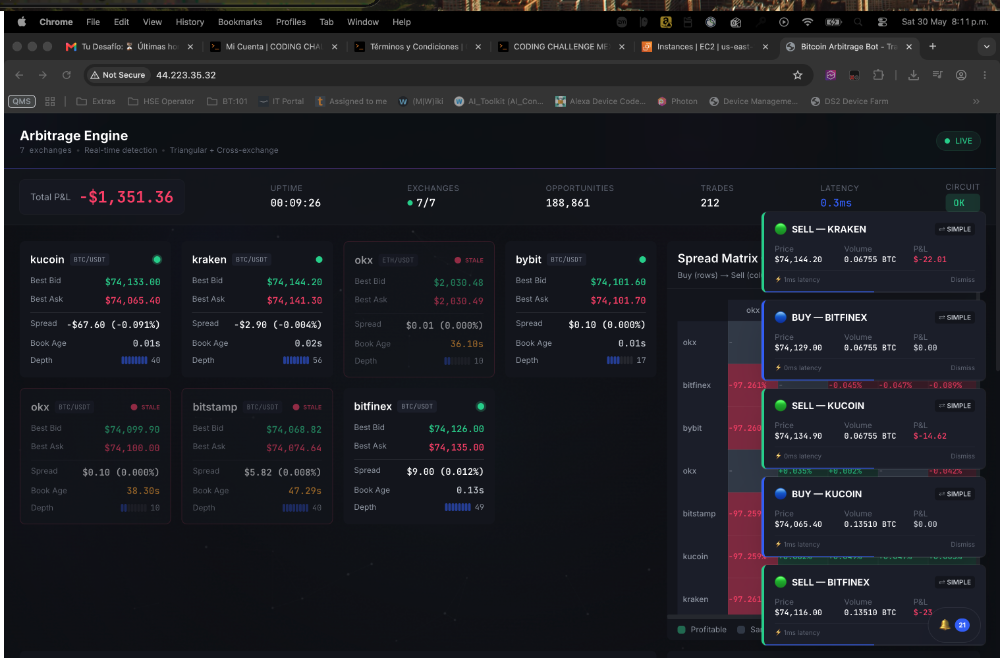
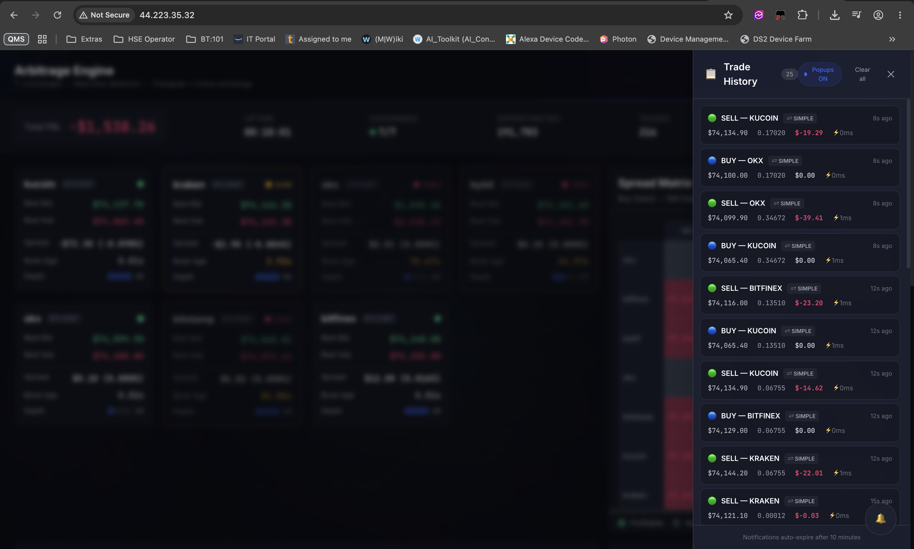
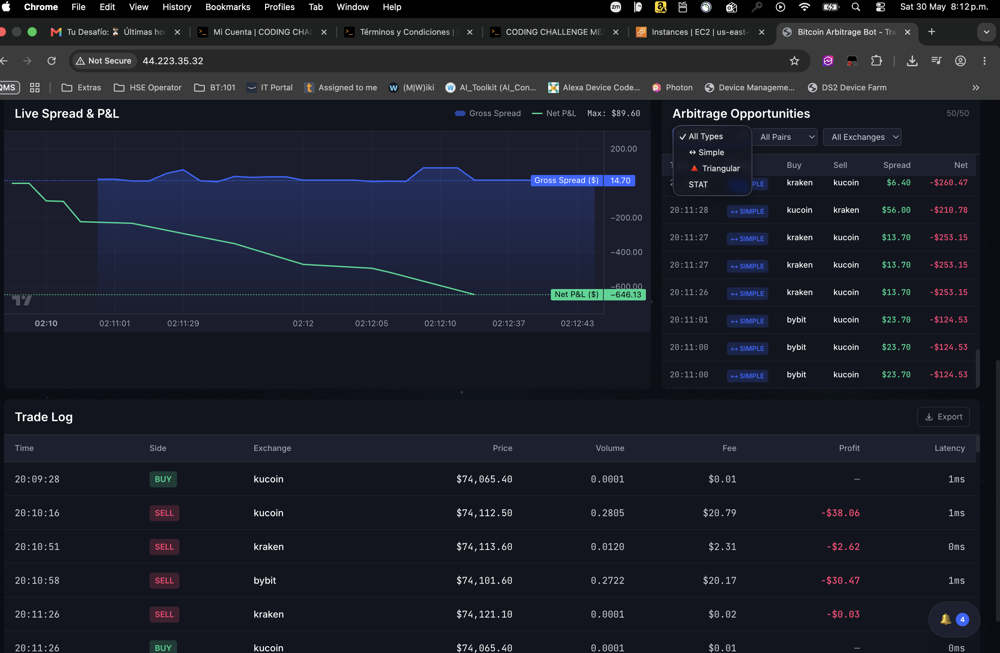
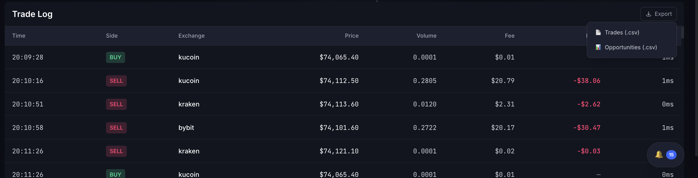
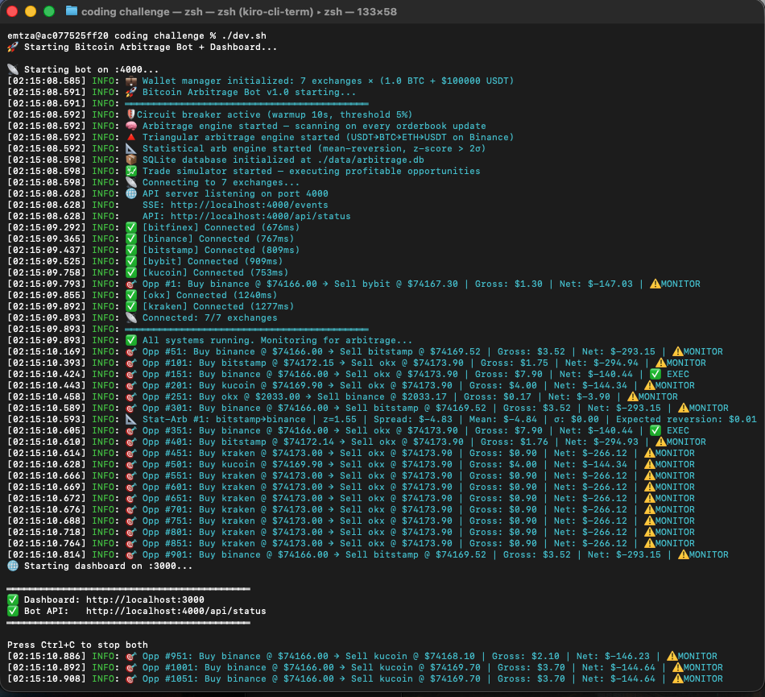
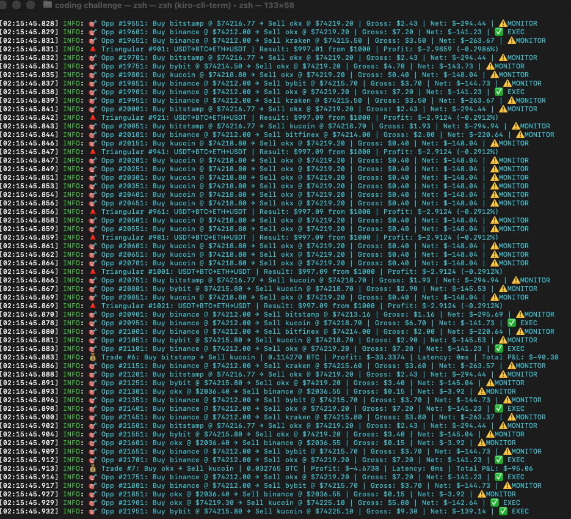
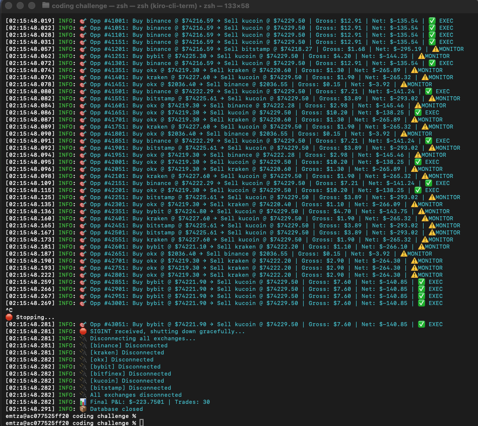
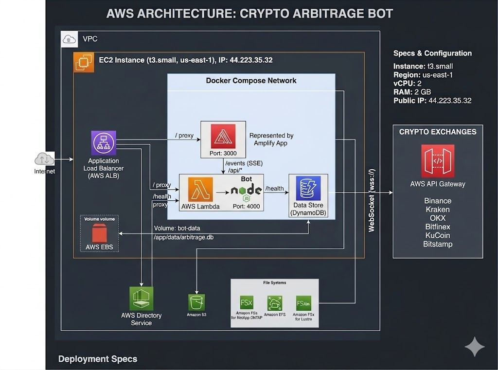

# ₿ Bitcoin Arbitrage Engine

> Real-time cross-exchange arbitrage detection & simulation with live dashboard.
> Built for **Coding Challenge Mexico 2026** — 48h hackathon.


## 🌐 Live Demo

> ⚠️ **Note:** Due to the data center location (us-east-1), exchanges take ~2 minutes to fully connect after a cold start. Wait for all 7 exchanges to show 🟢 status.

**Dashboard:** [http://44.223.35.32](http://44.223.35.32)  
**Health Check:** [http://44.223.35.32/health](http://44.223.35.32/health)  
**API Status:** [http://44.223.35.32/api/status](http://44.223.35.32/api/status)  
**Export Trades:** [http://44.223.35.32/api/export/trades.csv](http://44.223.35.32/api/export/trades.csv)

## 📸 Screenshots

### Dashboard Full View
*Real-time exchange cards, spread matrix, toast notifications (7/7 exchanges connected)*



### Notification Center
*Trade history drawer with Popups ON/OFF toggle and auto-expiring entries*



### P&L Chart + Opportunities Table
*Live spread tracking, filterable opportunities (type/pair/exchange dropdowns)*



### Trade Log + CSV Export
*Executed trades with one-click CSV download*



### Bot Startup Logs
*7 exchanges connecting, circuit breaker active, SQLite initialized, all systems running*



### Bot Running — Detection & Execution
*Cross-exchange + triangular opportunities detected, trades executed*



### Graceful Shutdown
*All exchanges disconnected, final P&L reported, database closed*



---

## 🎯 What It Does

Monitors BTC/USDT and ETH/USDT order books across **7 cryptocurrency exchanges** simultaneously via WebSocket, detects cross-exchange price discrepancies in real-time, and simulates trade execution respecting order book liquidity.

```
Exchange WebSockets → Normalized OrderBook → 3 Arb Engines → Risk Manager → Trade Simulator → SQLite + SSE → Dashboard
```

### Three Arbitrage Strategies

| Strategy | Description | How it works |
|----------|-------------|--------------|
| **⇄ Simple (Cross-Exchange)** | Buy low on exchange A, sell high on exchange B | Detects ask(A) < bid(B) across all exchange pairs |
| **△ Triangular** | Exploit pricing inefficiencies across 3 trading pairs | USDT→BTC→ETH→USDT cycle on Binance (3 legs, 3 fees) |
| **📊 Statistical (Mean-Reversion)** | Detect spread anomalies using z-score | Alerts when spread deviates > 1.5σ from rolling 120-point mean |

### Key Features

- ⚡ **Sub-100ms detection** — Event-driven architecture, no polling
- 📊 **7 exchanges** — Binance, Kraken, OKX, Bybit, Bitfinex, KuCoin, Bitstamp
- 🔺 **3 strategies** — Simple cross-exchange + Triangular + Statistical mean-reversion
- 💰 **Realistic simulation** — Walks order book depth, calculates real fees + slippage
- 🛡️ **8-point risk validation** — Circuit breaker, exposure check, rate limiting, stale data
- 📈 **Live dashboard** — Animated background, trade toasts, notification center
- 🗄️ **SQLite persistence** — Trades & opportunities survive restarts (WAL mode)
- 🧮 **Decimal precision** — All financial math uses Decimal.js (no floating point)
- 📱 **Responsive** — Mobile/tablet/desktop breakpoints with premium design
- 🔔 **Notification center** — Toast popups + persistent history drawer with toggle

---

## 🏗️ Architecture

```
┌─────────────────────────────────────────────────────────────────────────┐
│                      FRONTEND (Next.js 14)                               │
│                                                                          │
│  AnimatedBackground │ Header │ StatusBar (AnimatedCounter) │ Tooltips    │
│  ExchangePanel │ SpreadMatrix │ PnLChart │ OpportunitiesTable │ TradeLog │
│  TradeToast (popups + notification center + history drawer)              │
└──────────────────────────────────────┬──────────────────────────────────┘
                                       │ SSE + REST hydration
┌──────────────────────────────────────┴──────────────────────────────────┐
│                       BACKEND (Node.js/TS)                               │
│                                                                          │
│  ┌─────────────┐  ┌──────────────┐  ┌───────────┐  ┌───────────────┐   │
│  │ Connectors  │─▶│  3 Arbitrage │─▶│   Risk    │─▶│    Trade      │   │
│  │ (WebSocket) │  │   Engines    │  │  Manager  │  │   Simulator   │   │
│  └─────────────┘  └──────────────┘  └───────────┘  └───────┬───────┘   │
│         │                                                    │           │
│  ┌──────┴──────┐  ┌─────────────┐  ┌────────────┐  ┌───────┴───────┐   │
│  │ OrderBook   │  │   Circuit   │  │   Wallet   │  │   SQLite DB   │   │
│  │   Store     │  │   Breaker   │  │  Manager   │  │  (WAL mode)   │   │
│  └─────────────┘  └─────────────┘  └────────────┘  └───────────────┘   │
└──────────────────────────────────────────────────────────────────────────┘
         │
    WebSocket connections (persistent, incremental book updates)
         │
┌────────┼────────┬──────────┬──────────┬──────────┬──────────┬──────────┐
│Binance │ Kraken │   OKX    │  Bybit   │Bitfinex  │  KuCoin  │ Bitstamp │
└────────┴────────┴──────────┴──────────┴──────────┴──────────┴──────────┘
```

### Monorepo Structure

```
crypto-arbitrage-bot/
├── apps/
│   ├── bot/                    # Arbitrage engine (Node.js)
│   │   └── src/
│   │       ├── connectors/     # 7 exchange WebSocket clients
│   │       ├── engine/         # Detection, simulation, risk, API server
│   │       └── lib/            # Store, event bus, logger, DB, repository
│   └── web/                    # Dashboard (Next.js 14)
│       └── app/
│           ├── components/     # 11 UI components
│           └── hooks/          # SSE connection + hydration hook
├── packages/
│   └── shared/                 # Types, fee config, constants
├── data/                       # SQLite database (gitignored)
├── docker-compose.yml          # Production deployment
├── nginx/                      # Reverse proxy config
└── vitest.config.ts            # Test configuration
```

---

## 🚀 Quick Start

### Prerequisites
- Node.js 18+ (20+ recommended)
- npm 9+

### Run Locally

```bash
# Install dependencies
npm install

# Start both bot + dashboard
./dev.sh

# Or separately:
# Terminal 1 — Bot (connects to exchanges, port 4000)
npx tsx apps/bot/src/index.ts

# Terminal 2 — Dashboard (port 3000)
cd apps/web && npx next dev -p 3000
```

Open **http://localhost:3000** to see the live dashboard.

### Production Deploy (Docker)

```bash
docker compose up --build -d
# Dashboard: http://your-ip (nginx reverse proxy)
# API: http://your-ip/api/status
```

---

## 📊 How Arbitrage Detection Works

### Simple (Cross-Exchange)

For every pair of exchanges (A, B) and every trading pair:

```
if bestAsk(A) < bestBid(B):
    grossSpread = bestBid(B) - bestAsk(A)
    buyCost = bestAsk(A) × (1 + feeA_taker)
    sellRevenue = bestBid(B) × (1 - feeB_taker)
    netProfit = sellRevenue - buyCost - slippage

    if grossSpread > $5.00:
        execute_trade(buy_on_A, sell_on_B)
```

### Triangular (Single Exchange)

```
Route A: USDT → BTC → ETH → USDT (on Binance)
  1. Buy BTC with USDT     @ BTC/USDT asks[0]
  2. Buy ETH with BTC      @ ETH/BTC asks[0]
  3. Sell ETH for USDT     @ ETH/USDT bids[0]
  Profit = result - $1000 (starting capital per cycle)

Route B: USDT → ETH → BTC → USDT
  1. Buy ETH with USDT     @ ETH/USDT asks[0]
  2. Sell ETH for BTC      @ ETH/BTC bids[0]
  3. Sell BTC for USDT     @ BTC/USDT bids[0]
```

### Statistical (Mean-Reversion)

```
For each exchange pair (A, B):
  spreadHistory = rolling window of 120 spread samples
  mean = avg(spreadHistory)
  stdDev = stdev(spreadHistory)
  zScore = (currentSpread - mean) / stdDev

  if |zScore| > 1.5σ and samples >= 15:
      emit statistical opportunity
```

### Fee Matrix (pre-calculated at startup)

| Exchange | Maker | Taker | BTC Withdrawal |
|----------|-------|-------|----------------|
| Binance  | 0.10% | 0.10% | 0.0005 BTC |
| Kraken   | 0.16% | 0.26% | 0.00015 BTC |
| OKX      | 0.08% | 0.10% | 0.0001 BTC |
| Bybit    | 0.10% | 0.10% | 0.0002 BTC |
| Bitfinex | 0.10% | 0.20% | 0.0004 BTC |
| KuCoin   | 0.10% | 0.10% | 0.0005 BTC |
| Bitstamp | 0.30% | 0.30% | 0.0005 BTC |

### Slippage Estimation

The engine walks the order book depth to calculate realistic average fill prices:

```typescript
for (const level of orderBookLevels) {
    fillQty = min(remaining, level.quantity);
    totalCost += fillQty * level.price;
    remaining -= fillQty;
}
avgFillPrice = totalCost / totalFilled;
slippage = avgFillPrice - topOfBookPrice;
```

---

## 🛡️ Risk Management (8-Point Validation)

Every opportunity passes through the risk manager before execution:

| # | Check | Description |
|---|---|---|
| 1 | **Circuit Breaker** | Pauses if volatility > 5% in 15s window (10s warmup on startup) |
| 2 | **Freshness** | Rejects order books older than 3 seconds |
| 3 | **Anomaly Detection** | Rejects prices > 5% from median |
| 4 | **Re-verification** | Confirms opportunity still exists on fresh book data |
| 5 | **Volume Minimum** | Rejects trades < 0.0001 BTC |
| 6 | **Rate Limiting** | Max 60 trades/minute |
| 7 | **Pair Cooldown** | 5s between trades on same exchange pair |
| 8 | **Exposure Check** | Rejects if trade > 50% of wallet value |

---

## 🖥️ Dashboard

### UI Features

| Feature | Description |
|---------|-------------|
| **Animated Background** | Canvas-rendered floating gradient orbs (blue/purple/cyan) + subtle grid overlay |
| **Header** | Gradient text title + live status pill (🟢 LIVE / CONNECTING) |
| **Animated P&L Counter** | Count-up effect with easing (400ms, cubic ease-out) |
| **Toast Notifications** | Pop-up cards on every trade (5s auto-dismiss, progress bar) |
| **Notification Center** | 🔔 bell button → slide-out drawer with trade history (10 min TTL) |
| **Popup Toggle** | Enable/disable toast popups from the notification panel |
| **Tooltips** | Hover explanations on all metrics, matrix cells, and exchange fields |
| **Responsive Design** | Mobile (1-col) / Tablet (2-col) / Desktop (12-col grid) |
| **CSV Export** | One-click download of trades or opportunities as CSV from TradeLog dropdown menu |
| **Custom Scrollbar** | 6px translucent scrollbar, premium feel |

### Dashboard Components

| Component | What it shows |
|-----------|---------------|
| **StatusBar** | P&L (animated), uptime, exchanges (x/7), opportunities, trades, latency, circuit breaker |
| **ExchangePanel** | Cards per exchange:pair — bid/ask, spread, book age, depth bar chart |
| **SpreadMatrix** | Heatmap of cross-exchange spreads with cell-level tooltips |
| **PnLChart** | Lightweight Charts (TradingView) — spread + P&L over time |
| **OpportunitiesTable** | Filterable table (type/pair/exchange dropdowns) with counter |
| **TradeLog** | Executed trades — time, side, exchange, price, volume, fee, profit, latency |
| **TradeToast** | Floating notifications on trade execution (stacked on mobile, corner on desktop) |

### Exchange Health Indicators

| Indicator | Condition | Meaning |
|---|---|---|
| 🟢 Pulse (green) | Book age < 2s | Active — receiving live data |
| 🟡 SLOW (yellow) | Book age 2–5s | Degraded — data arriving slowly |
| 🔴 STALE (red) | Book age > 5s | Disconnected — card dimmed, excluded from detection |

---

## 🗄️ Database (SQLite)

Trades and executed opportunities persist across bot restarts.

```sql
-- Tables
opportunities (id, type, pair, buy_exchange, sell_exchange, buy_price, sell_price,
               gross_spread, net_profit, net_profit_percent, max_volume, detected_at, executed)

trades (id, opportunity_id FK, exchange, pair, side, requested_quantity, filled_quantity,
        average_price, total_cost, fee_paid, status, executed_at, latency_ms)
```

- **WAL mode** for concurrent reads during writes
- Frontend hydrates from `/api/history/trades` on page load (no data loss on reload)
- Docker volume `bot-data:/app/data` persists between container restarts
- Auto-creates `data/arbitrage.db` on first boot

---

## 📈 Performance

- **Exchange connections:** 7 simultaneous WebSocket streams
- **Pairs monitored:** BTC/USDT (7 exchanges) + ETH/USDT (2 exchanges) + ETH/BTC (1 exchange)
- **Scan rate:** ~1000+ scans/second
- **Detection latency:** <1ms from orderbook update to opportunity detection
- **Update frequency:** ~2000+ orderbook updates/second ingested
- **Directional pairs checked:** 42 (7×6) for BTC/USDT per scan
- **SSE throttle:** 500ms per exchange:pair (orderbook), unthrottled for triangular/statistical

---

## 🧪 Testing

```bash
npx vitest run          # Run all tests (40 tests)
npx vitest run --watch  # Watch mode
```

### Test Coverage

| Suite | Tests | What it validates |
|-------|-------|-------------------|
| `arbitrage.test.ts` | 11 | OrderBook store, opportunity detection, threshold logic, slippage estimation |
| `algorithms.test.ts` | 21 | Triangular math, risk manager logic, statistical z-score, net profit, circuit breaker |
| `fees.test.ts` | 8 | Fee matrix values, Decimal precision, all exchanges covered |

---

## 📁 API Endpoints

| Endpoint | Description |
|---|---|
| `GET /events` | SSE stream (orderbook, opportunity, trade, status events) |
| `GET /api/status` | Bot status + exchange connectivity |
| `GET /api/opportunities` | Last 50 detected opportunities (in-memory) |
| `GET /api/trades` | Last 50 executed trades (in-memory) |
| `GET /api/history/trades` | Last 100 trades from SQLite (persistent) |
| `GET /api/history/opportunities` | Last 200 opportunities from SQLite (persistent) |
| `GET /api/wallets` | Current wallet balances per exchange |
| `GET /api/pnl` | Portfolio P&L summary |
| `GET /api/export/trades.csv` | Download all trades as CSV (timestamped filename) |
| `GET /api/export/opportunities.csv` | Download all opportunities as CSV |
| `GET /health` | Health check |

---

## 🔧 Technical Decisions

| Decision | Rationale |
|---|---|
| **TypeScript strict mode** | Financial logic demands type safety; no `any` allowed |
| **Decimal.js** | Never floating-point for money math |
| **WebSocket-first** | Latency is the primary evaluation criterion |
| **Event emitter pattern** | Decouples producers from consumers cleanly |
| **SQLite (not Postgres)** | Zero-config, single-file, perfect for single-instance deployment |
| **WAL mode** | Concurrent reads while writes happen (no blocking) |
| **SSE over WebSocket** | Simpler for unidirectional dashboard streaming |
| **Canvas animated background** | GPU-accelerated, `requestAnimationFrame` for smooth 60fps |
| **npm workspaces** | Shared types between bot and web without publish step |
| **Docker Compose** | Single-command production deploy with nginx + Let's Encrypt |
| **Kraken/KuCoin local book** | Maintain Map state, apply deltas (not replace) for accurate depth |
| **MIN_EXECUTION_THRESHOLD=$5** | Low enough to show activity, high enough to filter noise |

---

## ☁️ AWS Architecture



### Deployment Specs

| Component | Specification |
|-----------|---------------|
| **Instance** | EC2 t3.small (2 vCPU, 2GB RAM, 20GB gp3) |
| **Region** | us-east-1 (N. Virginia) |
| **OS** | Amazon Linux 2023 |
| **Runtime** | Docker 25.0 + Compose v2.29 |
| **Security Group** | Ports 22 (SSH), 80 (HTTP), 443 (HTTPS) |
| **Persistence** | Named Docker volume (`bot-data`) |
| **Startup time** | ~2 min (7 exchanges connect sequentially) |

### Replicate Deployment

```bash
# 1. Launch EC2 (Amazon Linux 2023, t3.small, 20GB gp3)
# 2. SSH into instance
ssh -i your-key.pem ec2-user@YOUR_IP

# 3. Install Docker + Compose
sudo dnf install -y docker git
sudo systemctl enable docker && sudo systemctl start docker
sudo curl -sL https://github.com/docker/compose/releases/latest/download/docker-compose-linux-x86_64 \
  -o /usr/local/lib/docker/cli-plugins/docker-compose
sudo chmod +x /usr/local/lib/docker/cli-plugins/docker-compose

# 4. Clone and deploy
git clone https://github.com/EmilianoMartinezA/crypto-arbitrage-bot.git
cd crypto-arbitrage-bot
sudo docker compose up --build -d

# 5. Verify (wait ~2 min for exchanges to connect)
curl http://localhost/health
# {"status":"ok","uptime":120.5}
```

---

## 🐳 Docker & Deployment

```yaml
services:
  nginx:     # Reverse proxy (port 80/443)
  web:       # Next.js dashboard (standalone output)
  bot:       # Arbitrage engine + SQLite
    volumes:
      - bot-data:/app/data   # Persist DB across restarts
```

### Environment Variables

| Variable | Default | Description |
|----------|---------|-------------|
| `PORT` | `4000` | Bot API server port |
| `DB_PATH` | `./data/arbitrage.db` | SQLite database path |
| `LOG_LEVEL` | `info` | Pino log level |
| `NEXT_PUBLIC_API_URL` | `http://localhost:4000` | Bot URL for frontend |

---

## 👤 Author

**Emiliano Martinez** — Coding Challenge Mexico 2026

## 📄 License

MIT
